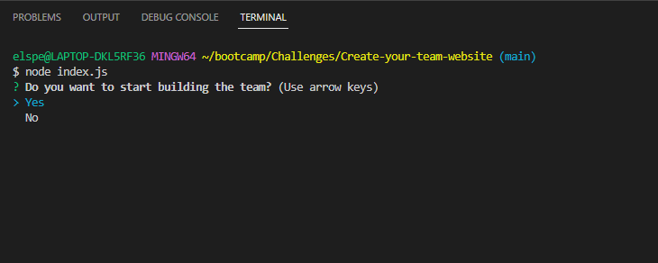
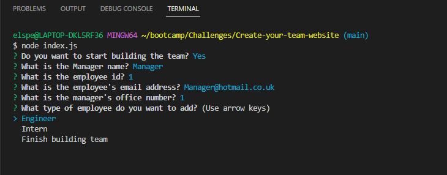
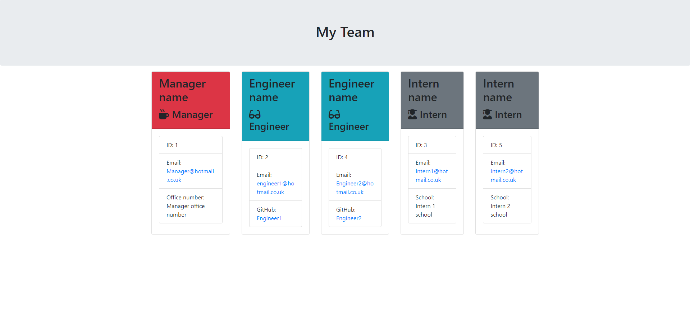

# Create-your-team-website


# Description
This is a company team building project using node.js, built using test driven development. It utilises npm packages including jest, inquirer, and an email validator. This code uses user input to reate an html file to create a website using bootstrap. The website utilises a jumbotron and cards. The information shown is different for each type of employee and only 1 manager is allowed.

## Table of contents
- [Usage](#usage)
- [Installation](#installation)
- [Contributing](#contributing)
- [License](#license)
- [Tests](#tests)
- [Questions](#questions)

## Usage
<ol>
<li>The terminal must be opened to the correct directory.</li>
<li>The index.js file must be run by typing 'node index.js'</li>
<li>The first question will ask if the user wants to start building a team</li>
</br>

  
  
<li>The user must first fill in information for the team manager.</li>
<li>Once the information for the team manager is filled in, the user can choose to add an engineer, an intern or to finish building the team.</li>
  
  

  
  
<ul>
<li>There is a validator for every user input.</li>
</ul>
<li>Once the user chooses "Finish building team", the htlm code will be generated as a "team.html" file and put to the "output" folder.</li>
<ul>
<li>The old html file will be deleted</li>
</ul> 
<li>The generated website will have the below functions (as shown below):</li>
<ul>
<li>The use of a bootstrap jumbotron.</li>
<li>The use of bootstrap cards.</li>
<li>Colour coded employee cards</li>
<li>For the team manager (only 1 allowed):</li>
<ul>
<li>Name</li>
<li>Employee ID</li>
<li>Email address and link</li>
<li>Office number</li>
</ul>
</li>

<li>For the engineers:</li>
<ul>
<li>Engineer's Name</li>
<li>Employee ID</li>
<li>Email address and link</li>
<li>GitHub username and link</li>
</ul>
</li>

<li>For the interns:</li>
<ul>
<li>Intern's Name</li>
<li>Employee ID</li>
<li>Email address and link</li>
<li>School name</li>
</ul>
</ul>


 


## Installation
To install, on the terminal type:
```
git clone git@github.com:Moobell1212/Create-your-team-website.git
```

Install the NPM packages writing the below in the terminal:
```
npm install
```

## Contributing
If there are any suggestions for improoving this project:
<ol>
<li>Fork the project</li>
<li>Create your branch</li>
<li>Commit your changes</li>
<li>Push your code to the branch</li>
<li>Create a merge request in the repository</li>
</ol>

## License
This project is licensed under the MIT license. For more information visit [https://opensource.org/licenses/MIT](https://opensource.org/licenses/MIT).

## Tests
None

## Questions
Contact the developer with any questions through GitHub: [Moobell1212](https://github.com/Moobell1212).
